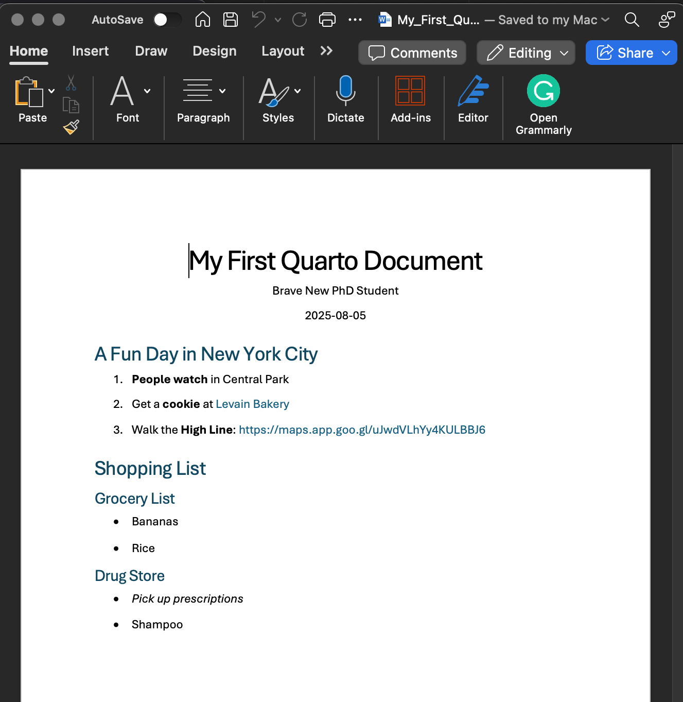
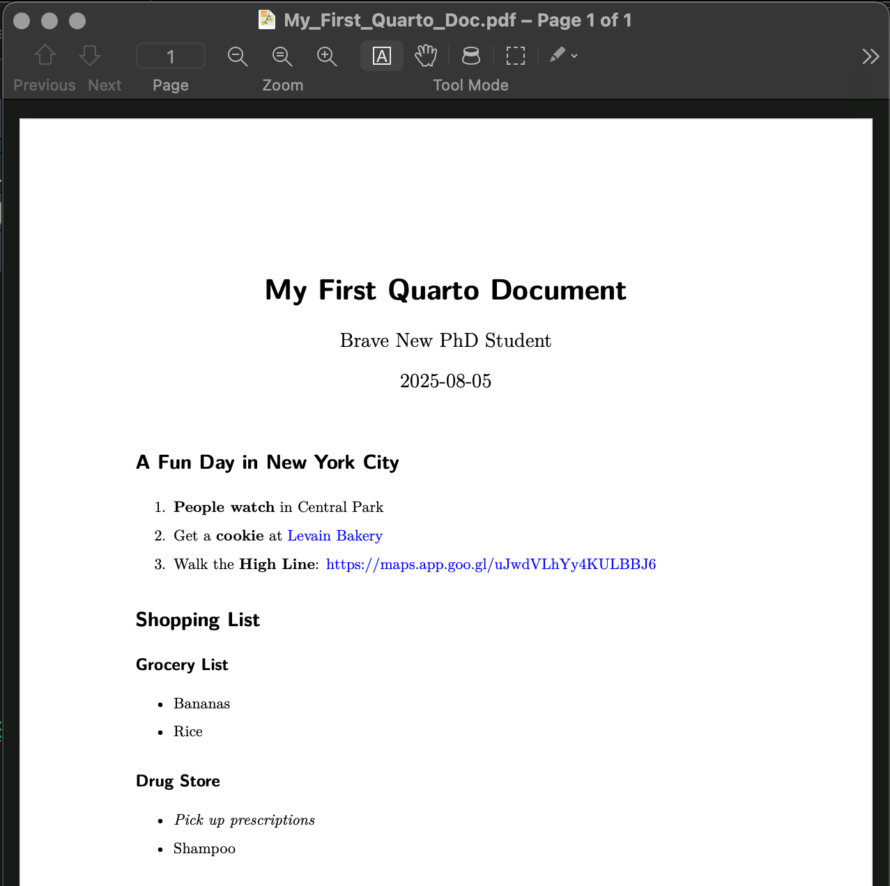

0---
title: "Lab 2b: Quarto"
---

## The Data Lifecycle

1.  **Data entry, import, cleaning**

2.  **Data analysis**

    -   Summary statistics

    -   Creating plots

    -   Running $t$ tests, ANOVAs, etc.

3.  **Reporting & Documentation**

    -   Archiving every step you did to manipulate your raw data

    -   Communicating your results clearly to (a) your audience, (b) your collaborators, and (c) your future self

In this course, we'll focus on steps 2 and 3, but you will also learn some data cleaning & manipulation methods along the way

## Quarto

-   Quarto is a text-processing language that is built into RStudio. It is used to **generate reports** (pdf, html, Word) that **integrate text, R code, R output, and R-generated plots**.

-   Quarto is the "next generation" of a tool known as **R Markdown**.

    -   Quarto files have ".qmd" extensions, R Markdown files have ".Rmd" extensions

    -   Most (but not all) functionality is the same between Quarto and R Markdown

-   These slides were written using Quarto!

-   You are expected to complete your homework assignments with Quarto if possible

-   With instructor permission, you may use R Markdown (.Rmd) instead of Quarto

## Quarto

To start a Quarto document (follow along!):

1.  File -\> New File -\> Quarto Document...

    -   Or from the drop-down menu at the upper-left side of the RStudio window

2.  Select "Document" on the left-hand side

    -   The "Presentation" and "Interactive" tabs are outside the scope of this class

3.  Choose the output type that you want (`pdf(Typst)` or `Word`)

    -   `pdf(LaTeX)` requires additional software be installed

4.  Set "Engine: knitr" if this is not set already

5.  **De-select** "Use visual markdown editor"

::: aside
Although the visual editor might be useful to you, it can also cause unexpected errors that may be more frustrating than helpful. I recommend **not** using the visual editor while you learn Quarto.
:::

## Quarto

-   Hit "OK", a new file will open in your script pane.

    -   You might see a banner near the top of your script pane that says "Package rmarkdown required but is not installed." If so, hit "Install".

::: {.callout-tip appearance="simple"}
**Review**: how do we check if packages are installed??
:::

-   Quarto gives us an example document that illustrates some of the features of Markdown.

-   To compile the document, hit the "Render" button above the script, go to File -\> Render Document, or type Cmd/Ctrl + Shift + K

    -   You will be asked to save the qmd file first

-   In the same folder in which you saved the qmd document, a pdf or Word document should be produced (it might even open automatically). Take a minute or two to look at and compare the pdf document and the qmd script.

## Quarto

Let's take a closer look at the first few lines of the qmd file. The first few lines will look something like this:

```         
---
title: "Untitled"
format: docx
---
```

This is called A YAML header. You can change the title to anything that you want, so long as it is within quotation marks. The "format" line only understands certain inputs, and it's easiest to specify the type of output through the point-and-click menu we used to create this file.

. . .

You can also add an author and date to this section like this.

```         
---
title: "My First Quarto Document"
format: docx
author: Brave New PhD Student
date: today
---
```

## Quarto

-   Documentation for Quarto is available on its website: <https://quarto.org/docs/guide/>

-   On your own, you might want learn about some of the basic features: <https://quarto.org/docs/authoring/markdown-basics.html>

-   There are **many** features, so the documentation might be overwhelming at first. Next, we'll guide you through some of the most useful-to-you features.

<!-- Add information about how you can have text mixed with code chunks -->

## Quarto

After the YAML header, you can write any text you'd like.

Quarto also has some features to mark up your text:

-   Put 1 asterisk before and after text to make \**italics*\*

-   Put 2 asterisks before and after text to make \*\***bold**\*\*

-   Use hash marks to delineate different sections of your text:

\# Level 1 Header

\## Level 2 Header

## Quarto Example: Word Output

::::: columns
::: column
**Quarto Document**:

```         
---
title: "My First Quarto Document"
format: docx
author: Brave New PhD Student
date: today
---

# A Fun Day in New York City

1. **People watch** in Central Park

2. Get a **cookie** at [Levain Bakery](https://levainbakery.com/)

3. Walk the **High Line**: <https://maps.app.goo.gl/uJwdVLhYy4KULBBJ6>

# Shopping List

## Grocery List

* Bananas

* Rice

## Drug Store

* *Pick up prescriptions*

* Shampoo
```
:::

::: column
**Word Document:**


:::
:::::

## Quarto Example PDF Output

::::: columns
::: column
**Quarto Document**:

```         
---
title: "My First Quarto Document"
format: typst
author: Brave New PhD Student
date: today
---

# A Fun Day in New York City

1. **People watch** in Central Park

2. Get a **cookie** at [Levain Bakery](https://levainbakery.com/)

3. Walk the **High Line**: <https://maps.app.goo.gl/uJwdVLhYy4KULBBJ6>

# Shopping List

## Grocery List

* Bananas

* Rice

## Drug Store

* *Pick up prescriptions*

* Shampoo
```
:::

::: column
**PDF Document:**


:::
:::::

## Including R Code in Quarto

-   To begin an R code "chunk", type 3 back ticks (the button above "Tab" on most keyboards), followed by {r}

-   To end an R code "chunk" type 3 back ticks.

-   R code chunks look like the following (without the extra spaces):

```         
` ` ` {r}
x <- 2 + 3 # R code goes in between the sets of tick marks
` ` `
```

**Keyboard shortcut**: Cmd/Ctrl + Opt + i

## Including R Code in Quarto

-   As with ordinary R scripts, you can use Cmd/Ctrl + Enter/Return to run R commands

    -   Click within the code chunk first

-   By default, output (e.g., plots) are displayed within the script pane

    -   If you want move output to its usual spot, click on the gear icon (to the right of the Render button) and check "Chunk Output in Console"

## Including R Code in Quarto

Within the curly brackets that open an R code chunk, you can specify several options. A full list is on the cheat sheet, but these are the options I use most often.

{r echo = TRUE, eval = TRUE, include = TRUE, fig.height = 7, fig.width = 5}

-   `echo`: TRUE or FALSE, whether to include the R code along with the output

-   `eval`: TRUE or FALSE, whether to include the R output along with the code

-   `include`: TRUE or FALSE, if FALSE evaluate but don't include input or output

-   `fig.height/fig.width`: dimension of plot in the graphics engine (in inches)

## Practice

How would you implement the following?

1.  A chunk that shows the code for multiplying 2 \* 3, but not the output

2.  A chunk that shows the output for multiplying 3 \* 4, but not the code

3.  A chunk that shows both the code and output for multiplying 4 \* 5

## Practice Answers

1.  A chunk that shows the code for multiplying 2 \* 3, but not the output

-   `{r echo = TRUE, eval = FALSE}`

```{r echo = TRUE, eval = FALSE}
2 * 3
```

2.  A chunk that shows the output for multiplying 3 \* 4, but not the code

`{r echo = FALSE, eval = TRUE}`

```{r echo = FALSE, eval = TRUE}
3 * 4
```

3.  A chunk that shows both the code and output for multiplying 4 \* 5

`{r echo = TRUE, eval = TRUE}`

```{r echo = TRUE, eval = TRUE}
4 * 5
```

## Activity: My Quarto file Won't Compile :(

On Blackboard, there is a Quarto file that contains errors that will cause it not to render. Download the `Debugging_Quarto.qmd` file and let's try to solve the errors together until the file renders!

- We will also need the `sat_data.csv` dataset to run the code. 

- Don't worry too much about understanding the *content* of the document, focus on trying to get the output to render and look as it should

The following slides are not very detailed, as the process of solving rendering issues varies greatly.


## Step 1: Make sure R code works

Before you even attempt to render the document, it is good practice to clean your environment and run all your R code chunks sequentially.

- To quickly run all the code chunks either navigate to the `run` option in the to right of the source pane and click `Run All`, or use the shortcut `CMD + Option + R` on MAC or `CTRL + Alt + R` on Windows

Working in pairs, try to solve the code errors until all the chunks run sequentially. 

## Step 2: Render and solve LaTeX errors

If all your R chunks run fine and your document still does not render, there is probably some problem with other parts of your text. 

Read the error messages, but know that some messages are more helpful than others.

* Some error messages reference lines in your .qmd file

* Some error messages reference lines in a .tex or .log file

If your Quarto file fails to render, you may find a **.tex** file and/or a **.log** file in the same folder as the .qmd document.

* Don't edit the .tex file directly, but inspecting this file may give you more information about what causes the problem

## Some More Debugging Strategies

* Pay attention to which file that the error message references - line numbers will be the line number in that file

* Do an internet search for the error message

* Run smaller parts of the document to help diagnose where the problem lies (delete or comment out other sections)

* **Persevere!** Take breaks, give yourself enough time to deal with these potential logistical problems. Debugging often takes longer than you think that it should

## Debrief

Review the "Debugging_Quarto_Answer.qmd" document to see if you found the same 7 fixes!